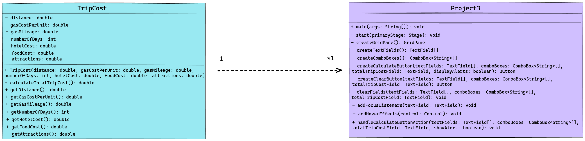

<!-- Title -->
<h1 align="center">Trip Cost Calculator</h1>
<p align="center">


<i>This project features a Java application comprising two classes: Project3 and TripCost. The Project3 class defines a graphical user interface (GUI) facilitating user input of trip details such as distance, gas cost per unit, gas mileage, number of days, hotel cost, food cost, and attractions cost. On the other hand, the TripCost class functions as an immutable representation of a trip cost object, with a constructor to instantiate TripCost instances encapsulating trip parameters and a method to compute and return the total trip cost. Together, these classes provide users with a convenient tool to estimate trip expenses, aiding in better travel planning and budget management. The user-friendly interface enables effortless input of trip details, resulting in accurate cost estimates and enhancing the overall travel experience.
</i></p>

---

<h2 align="center">Tech Used 🧰</h2>

<!-- Tech Stack -->
<p align="center">
<kbd>
<a href="https://www.java.com/en/">
    
  </a> | <a href="https://makefiletutorial.com/">
    
  </a> | <a href="https://git-scm.com/">
    
  </a>
  
  </kbd>
</p>

## User Guide 📔

This guide provides instructions on how to set up and run the project using two different methods: Cloning the repository and downloading the project as a ZIP file.

### Prerequisites

Before you begin, ensure you have the following installed:
- Java JDK
- [JavaJX](https://openjdk.org/) (Note: JavaFX is required to run the project. Download and install it before proceeding. Place the JavaFX .jar files in a `lib` directory at the root of the project.)
- Git (for cloning the repository)

### File Structure

<details>
<summary><b>See File Tree</b></summary>

The suggested file structure for your project is as follows:

```

.
└── road_trip_cost/
    ├── .vscode/
    │   ├── launch.json
    │   └── settings.json
    ├── bin/
    │   ├── main class files
    │   ├── test class files
    │   └── trips.json
    ├── lib/
    │   └── javafx.jar files
    ├── public/
    │   └── image files
    ├── src/
    │   ├── main/
    │   │   ├── Controller.java
    │   │   ├── main.fxml
    │   │   ├── Project3.java
    │   │   └── TripCost.java
    │   └── test/
    │       ├── GenerateTripData.java
    │       ├── Project3Test.java
    │       ├── TestRunner.java
    │       └── TripCostTest.java
    ├── Makefile
    ├── .gitignore
    └── README.md

```

</details>

### Setup launch.json

Every file that requires usage of the JavaFX modules, needs “vmArgs” in its configuration.

<details>
<summary><b>See launch.json Example</b></summary>

```

{
  "version": "0.2.0",
  "configurations": [
    {
      "type": "java",
      "name": "GenerateTripData",
      "request": "launch",
      "mainClass": "test.GenerateTripData",
      "projectName": "road_trip_cost_7cb99a68"
    },
    {
      "type": "java",
      "name": "Project3Test",
      "request": "launch",
      "mainClass": "test.Project3Test",
      "projectName": "road_trip_cost_7cb99a68",
      "vmArgs": "--module-path /home/slozier/Desktop/javafx-sdk-21.0.2/lib --add-modules javafx.controls,javafx.fxml"
    }
  ]
}

```

</details>

### Option 1️⃣ : Cloning the Repository

1. **Clone the Repository**

   Open your terminal and run the following command to clone the repository: **`git clone git@github.com:sllozier/road_trip_cost.git`**


2. **Navigate to the Project Directory**

    Once the repository is cloned, navigate to the project directory: **`cd path/to/road_trip_cost`**

3. **Using the Makefile**

    - To generate text files, compile the project, run tests, and then run the project code (if tests pass), use: **`make all`**

    - To only generate the text files, use: **`make generate_json_file`**

    - To run tests (this will also generate text files), use:**`make run_tests`**

    - To run the project code (this will also generate text files), use:**`make run_project`**

    - To clean up and remove generated files, use: **`make clean`**


### Option 2️⃣ : Downloading the ZIP File

1. **Download the Project**

    Go to the repository page on GitHub (or relevant hosting service), and click on the **`Download ZIP`** button. Save the ZIP file to your desired location and extract it.

2. **Navigate to the Project Directory**

    Open your terminal and navigate to the extracted project directory: **`cd path/to/extracted/road_trip_cost`**

3. **Using the Makefile**

    Follow the same steps as in **Option 1** for using the Makefile.

---

*Remember to replace **`[repository URL]`** and **`path/to/road_trip_cost`** with the actual URL of your repository and the path to the **`road_trip_cost`** directory in your local system. This guide assumes that the Makefile is located in the **`road_trip_cost`** directory and is set up as previously discussed.*

---

## Approach

For this project, I began by analyzing the requirements outlined in the project description. I identified the need for two classes: `TripCost` to handle trip cost calculations and `Project3` to manage the user interface. I chose Java for its robustness and platform independence. Leveraging JavaFX, I designed the GUI with a grid layout for user input and feedback components. Throughout development, I prioritized modularity and encapsulation, ensuring each class had well-defined responsibilities. I conducted thorough testing to ensure the application's functionality and user experience met the project requirements. Finally, I facilitated project management and automation by implementing a Makefile, streamlining tasks such as compilation, testing, and running the application.

## Assumptions

I assumed that users would interact with the GUI components in a logical manner, following the intended workflow of entering trip details and triggering cost calculations. Lastly, I assumed that the Makefile setup and directory structure would remain consistent across development environments, enabling seamless compilation, testing, and execution of the application. These assumptions guided the design and testing phases, ensuring the project's functionality aligned with user expectations.

## Lessons Learned

Throughout the development process, several key insights were gained:

- **Handling JavaFX Application Threads**: Encountered an `IllegalStateException` due to running the JavaFX `Application` in multiple files. Properly closing the JavaFX Application using `primaryStage.close()` resolved this issue. Similarly, terminating the Application thread properly using `Platform.exit()` prevented the process from hanging up during tests.

- **Testing Challenges**: Initially attempted to traverse nodes using `javafx.scene.Node` in `Project3Test`, but encountered issues. Recognized that utilizing a testing library like JUnit could have simplified this process and enhanced testing efficiency.

- **Makefile Modification**: Utilized a Makefile for project organization, but encountered challenges due to the usage of a .json file for testing and JavaFX .jars for other classes. Had to modify file paths within the Makefile to accommodate different directories. This involved rewriting the path to the json file in `TripCostTest` to prevent hardcoding and ensure flexibility across environments.


## Possible Improvements

To further enhance the project, the following areas can be addressed:

- **Refactor Testing**: I could enhance the testing approach by transitioning to `JUnit`. Instead of manually creating test cases and running them in separate classes, I could utilize JUnit's framework to create organized test classes with annotated methods for each test case. This would streamline the testing process and improve maintainability.

- **User Interface Enhancements**: There is room for improvement in the user interface by incorporating visual feedback to indicate the progress or completion of operations. Implementing features such as loading spinners during data processing or confirmation messages upon task completion would enhance the user experience and make the application more user-friendly.

- **Modularization and Encapsulation**: To enhance the codebase's organization and maintainability, I could modularize and encapsulate the code into smaller, well-defined modules. This would involve breaking down the application into separate modules for GUI components, business logic, and data access, promoting modularity and encapsulation principles.

- **Integration Testing**: Developing integration tests to validate the interactions between different components of the application would ensure its robustness. By creating tests that verify the interactions between UI components, business logic, and data access layers, I can ensure that the application functions correctly as a whole.

- **Code Duplication in Test Classes**: Both `TripCostTest.java` and `Project3Test.java` classes contain duplicated code for handling file I/O operations, such as reading JSON data from a file and parsing it. To avoid this duplication, I could refactor the code by creating a common utility method for these operations. This utility method could be placed in a separate utility class and reused across both test classes, improving code maintainability and reducing redundancy.

---

### UML Diagram

<details>
<summary><b>See Diagram</b></summary>

</details>

---


<h2 align="center">Contact Me 🦄</h2>
<!-- Contact Me -->
<p align="center">
<kbd>
<a href="mailto:sarah.lozier@gmail.com">
    
  </a> | <a href="https://www.sllozier.com">
    
  </a> | <a href="https://www.linkedin.com/in/sarah-l-lozier/">
    
  </a> | <a href="https://github.com/sllozier/resume/raw/main/sarah_lozier_resume%20.pdf">
    
  </a>
  </kbd>
</p>


